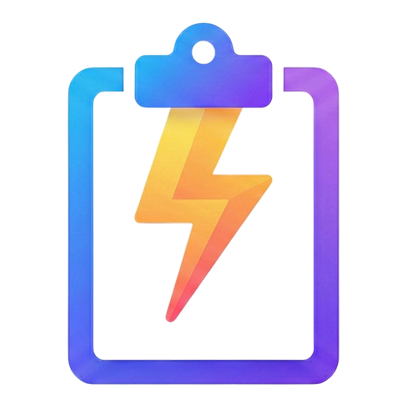

# Clipmighty

<p align="center">
  
</p>

<p align="center">
  <strong>A powerful and privacy focused clipboard manager for macOS</strong>
</p>

<p align="center">
  Clipmighty is a native macOS menu bar application that provides seamless clipboard history management with cloud sync, customizable shortcut, and privacy controls.
</p>

---

## ✨ Features

### **Intelligent Clipboard Management**

- **Status Bar Access**: Quick access to your clipboard history from the menu bar
- **Customizable Shortcut**: Access clipboard history easily without moving your hands from keyboard
- **One-Click Paste**: Click any item to instantly copy it back to your clipboard
- **Rich Content Support**: Handles text, images, and various clipboard formats
- **Edit History**: Modifiable existing clipboard entries

### **Powerful Search**

- Search through your entire clipboard history with instant results
- Filter and find content quickly with text-based search

### **Cloud Synchronization**

- Optional private iCloud integration for cross-device sync

### **Privacy & Security**

- **App Filtering**: Exclude any apps from clipboard history (e.g. password managers or private browsers)
- **Auto-Cleanup**: Configure automatic deletion of old clipboard items
- **Local-First with optional cloud-sync**: All data stored locally with SwiftData, optional sync with your private iCloud

### **Smart Management**

- Negligible system resource usage with intelligent background monitoring
- Native macOS design with SwiftUI

---

## 🚀 Getting Started

### Prerequisites

- **macOS**: Recent version (macOS 13.0+)
- **Xcode**: Latest version (15.0+)
- **Apple Developer Account**: Required for code signing & iCloud container functionality

### Initial Setup

1. **Clone the repository**

   ```bash
   git clone https://github.com/adani/Clipmighty.git
   cd Clipmighty
   ```

2. **Configure Team Settings**

   Copy the template configuration and add your Apple Developer Team ID:

   ```bash
   cp Config/TeamConfig.xcconfig.template Config/TeamConfig.xcconfig
   ```

3. **Edit Team Configuration**

   Open `Config/TeamConfig.xcconfig` and replace `YOUR_TEAM_ID_HERE` with your actual Team ID:

   ```
   DEVELOPMENT_TEAM = YOUR_TEAM_ID_HERE
   ```

   Find your Team ID at: <https://developer.apple.com/account/#/membership>

   > **Note**: `TeamConfig.xcconfig` is not tracked by git. Each developer needs to create their own file.

### Building and Running

#### Option 1: Using Xcode

1. Open the project:

   ```bash
   open Clipmighty.xcodeproj
   ```

2. Select the **Clipmighty** scheme

3. Build and run:
   - Press `⌘R` to build and run
   - Or use Product → Run from the menu

#### Option 2: Using Command Line

Build the project:

```bash
xcodebuild -project Clipmighty.xcodeproj -scheme Clipmighty -destination 'platform=macOS' build
```

Run tests:

```bash
xcodebuild test -project Clipmighty.xcodeproj -scheme Clipmighty -destination 'platform=macOS'
```

### First Launch

On first launch, Clipmighty will request **Accessibility permissions** to monitor the clipboard. This is required for the app to function:

1. Go to **System Settings** → **Privacy & Security** → **Accessibility**
2. Enable permissions for **Clipmighty**

---

## 🏗️ Architecture

### Tech Stack

- **Language**: Swift
- **UI Framework**: SwiftUI
- **Data Persistence**: SwiftData

---

## 🛠️ Development

### Code Quality

The project uses **SwiftLint** for code style enforcement. Run before committing:

```bash
swiftlint
```

Static analysis:

```bash
xcodebuild analyze -project Clipmighty.xcodeproj -scheme Clipmighty -destination 'platform=macOS'
```

### Contributing

Contributions are welcome! Please ensure:

- Code follows SwiftLint guidelines
- All tests pass
- No static analysis warnings
- Features are documented

---

## 📄 License

This project is licensed under the **Creative Commons Attribution-NonCommercial 4.0 International License (CC BY-NC 4.0)**.

**You are free to:**

- Share — copy and redistribute the material
- Adapt — remix, transform, and build upon the material

**Under the following terms:**

- **Attribution** — You must give appropriate credit
- **NonCommercial** — You may not use the material for commercial purposes

See the [LICENSE](LICENSE) file for details.

---

## 📧 Support

For issues, feature requests, or questions, please open an issue on GitHub.
